# 2022-10-17

~~上午10点到实验室~~

------

莫名其妙地，git又又又又失效了，测试一下ssh

```shell
ssh -T git@github.com
```

显示以下错误：

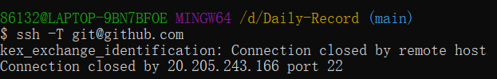

尝试了许多方法，包括取消代理服务器、重新设置私钥等，都没能解决，最终决定改用https连接了

首先修改别名，这里我起名为origin-https

```shell
git remote add origin-https <https地址>
```

查看远程连接情况：

```shell
git remote -v 
```

接下来就可以愉快地git push了（记得挂梯子），注意git push的时候要通过origin-https

------

了解了VPN和代理服务器相同点和不同点。

相同点是代理服务器和VPN都是会通过一个中间服务器传送信息，当你浏览一个网站的时候，网站所在的服务器可以根据你的IP地址来推断你所在的位置。而代理和VPN则可以用它们的IP替代你的，从而达到掩盖你的真实IP的效果。

不同点是VPN比代理服务器更安全，VPN会对数据进行加密再传递给VPN服务器，这项技术也叫“隧道”。而通过代理服务器传送的数据做不到这么好的隐蔽性，至少在你和代理服务器之间传送数据这个阶段是做不到的，也就是黑客或者网络服务商都能看到你在传输什么。相应地，VPN也会比代理服务器更贵一点。同时，加密隧道是你的设备建立的，因此所有的离岸数据都是在你的设备上完成加密的。这可能会不同程度上拖慢你的设备速度，从而影响整个浏览体验。

------

下午读了Inductive的相关论文

------

对应一个给定的矩阵A，如果有一个向量v，使得矩阵A作用于v之后（即A和v相乘），得到的新向量和v仍然保持在同一直线上，即只对向量v进行scale，方向不变。则向量v为特征向量，$$\lambda$$为特征值。
$$
Av=\lambda v
$$
$V$为特征向量组合，$D$为特征值的对角矩阵
$$
V=\begin{equation}
	\begin{bmatrix}
	 v_1 & v_2 & v_3  &\cdots  &v_n
	 \end{bmatrix}
\end{equation}
$$

$$
D=\begin{equation}
	\begin{bmatrix}
	 \lambda_1 &   & &  \\
	  & \lambda_2 &  & \\
	  &   & \ddots&\\
	  &   &  &\lambda_n
	 \end{bmatrix}
\end{equation}
$$

则有：
$$
A=VDV^{-1}
$$
拉普拉斯矩阵（Laplacian martix）：
$$
L=D-A
$$
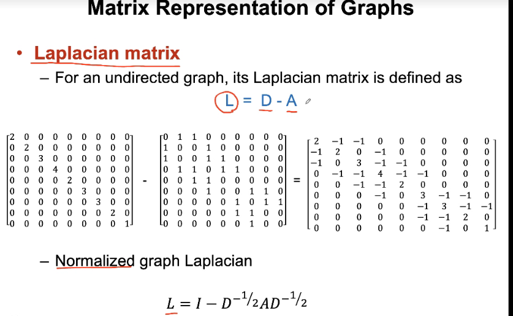

拉普拉斯是图上的差分运算，他是对称以及半正定（每个特征值非负）的

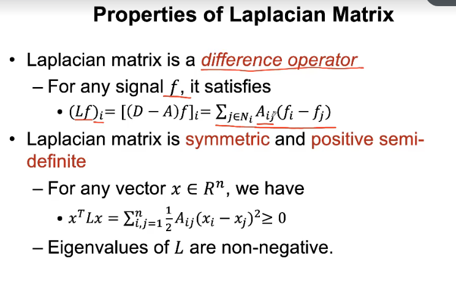

拉普拉斯矩阵有n个互相正交的特征向量，将n个特征值排序就得到图的谱

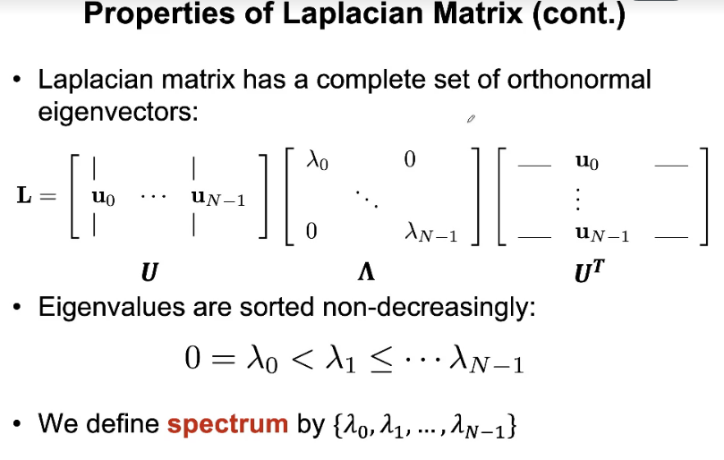

图上的傅里叶变换是一个矩阵相乘，$U$的每一列都是拉普拉斯矩阵的一个特征向量

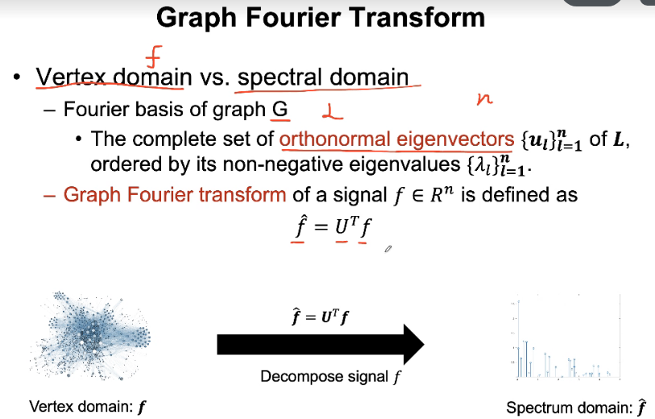

图上傅里叶逆变换

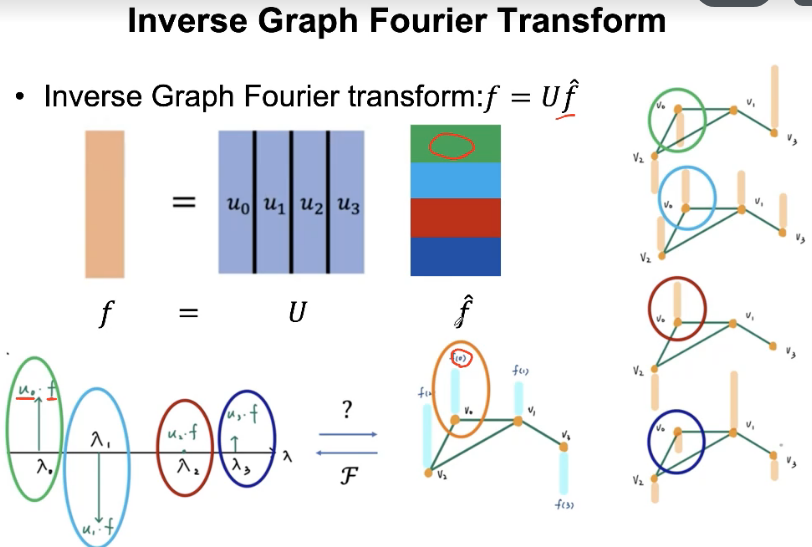

图上信号的卷积就是谱域上的点积

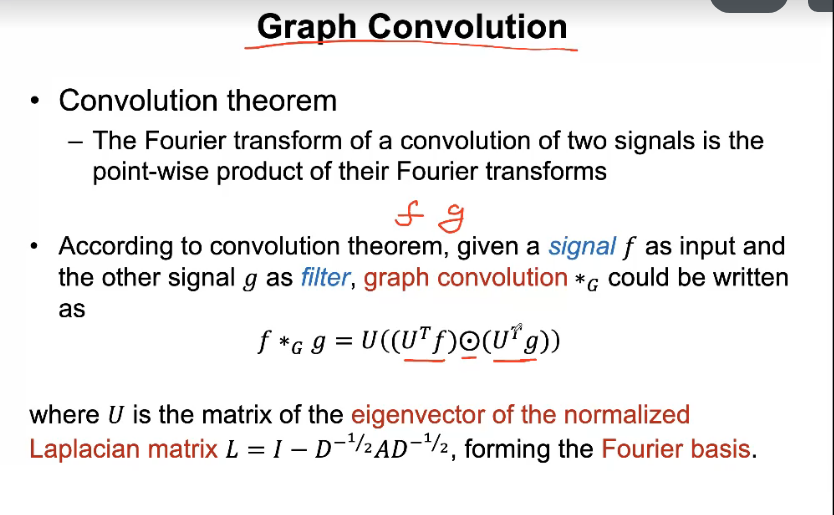

将$U^{T}g$视为一个整体，也即直接在谱域上定义卷积核

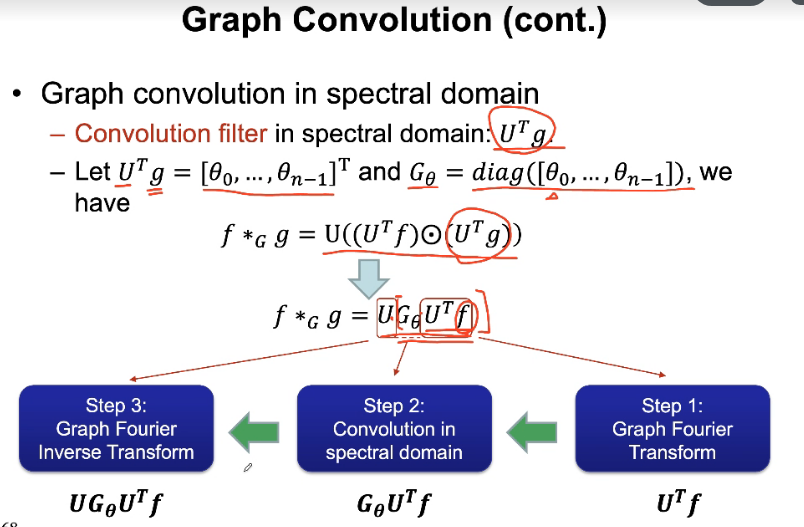

第一个提出的图上卷积：

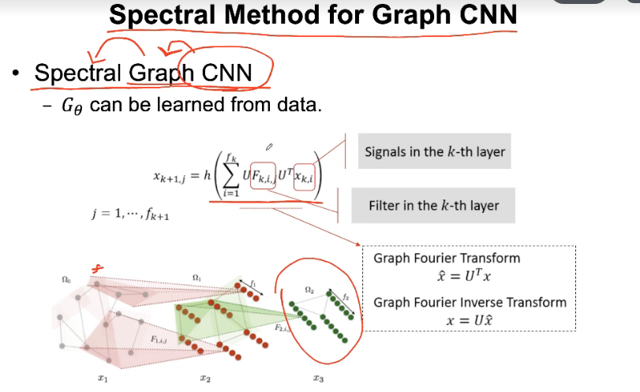

ChebyNet优化上面的模型：

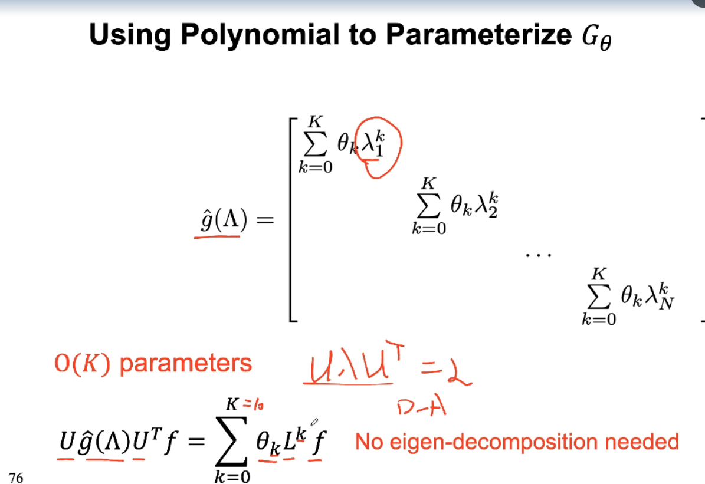

以上是谱域中的卷积，接下来介绍图中空间卷积，首先是GCN：

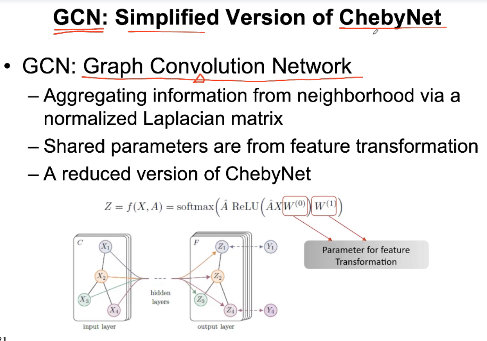

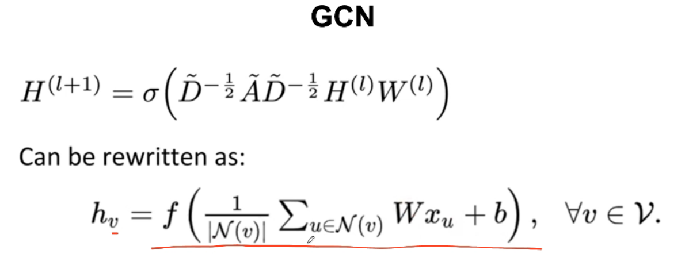

图注意力网络GAT：

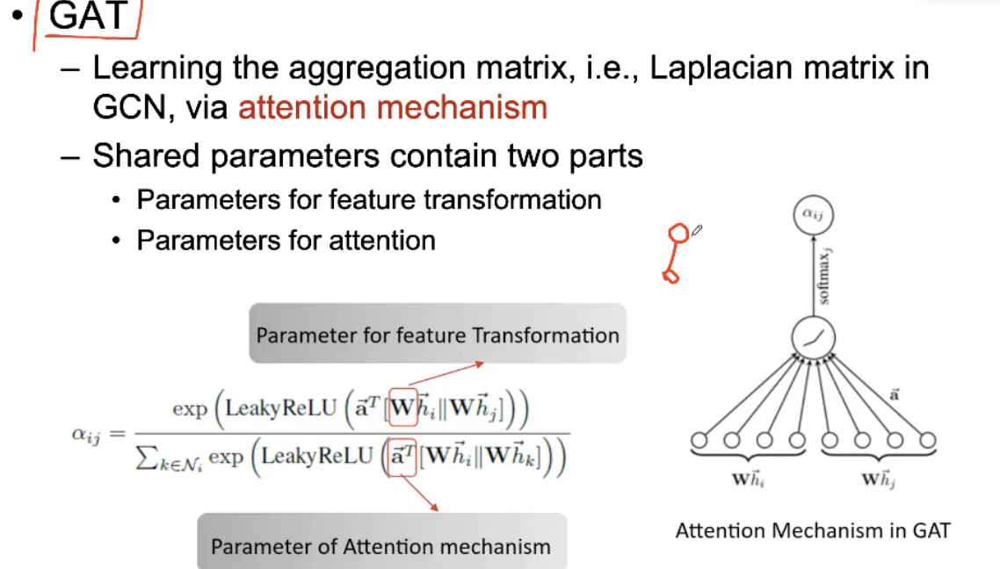