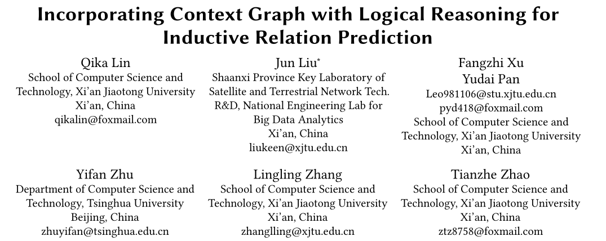

今天分享一篇SIGIR 2022的论文，题目名为Incorporating Context Graph with Logical Reasoning for Inductive Relation Prediction，从题目可以看出这篇论文是做Inductive任务的，同时还建立了Context Graph来满足逻辑推理的需要。

论文地址：https://web.archive.org/web/20220711200404id_/https://dl.acm.org/doi/pdf/10.1145/3477495.3531996

## Motivation

由于实体独立关系建模的需求和离散逻辑推理的解释性二者难以权衡，所以目前无法精确进行归纳关系预测。

本文提出了一种新的模型ConGLR，将context graph和逻辑推理结合起来。首先，提取并初始化目标头尾实体的封闭子图。然后介绍了包含关系路径、关系和实体的context graph。其次，利用两个具有实体和关系信息交互的图卷积网络分别处理子图和context graph。考虑到不同边缘和目标关系的影响，本文为子图GCN引入了边缘感知和关系感知注意机制。最后，通过将关系路径作为规则体，目标关系作为规则头，将神经计算和逻辑推理结合起来，得到归纳分数。

## Preliminary

这里声明了两个定义

- Connected and Closed Horn Rule. 就是形如下面的霍恩规则：

  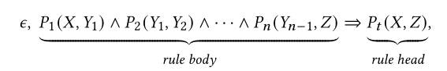

这里$\epsilon$用来表示这个霍恩规则的置信度

- Relational Path. 就是关系路径，一些连续的关系可以表示为一条关系路径

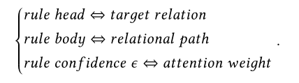

之后本文将规则头对应为目标关系，规则体对应为关系路径，关系置信度对应为注意力权重。这也是文中如何将context graph与逻辑推理结合的。

下面是文中一些数学符号的含义：

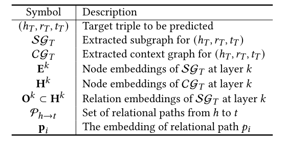

## Methodology

ConGLR模型的整体架构图如下所示：

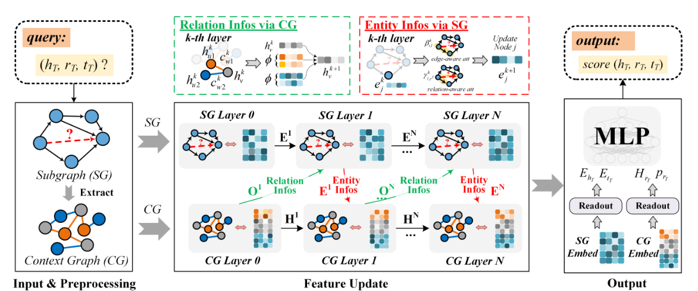

#### Subgraph and Context Graph Preprocessing

子图的提取和初始化为GraIL中的方法一样，主要介绍一下context graph的提取。

context graph的提取基于子图。context graph的节点集合包括子图中的实体、关系和关系路径，context graph的关系集合包括关系上下文和路径上下文，关系上下文用来连接实体和关系，路径上下文用来连接关系路径和关系。文中用一个图很清楚地描述了context graph的提取过程：

#### Context Graph Modeling

这部分包含节点表示初始化和特征聚合两个方面。

context gtaph节点分为三个部分，需要对这三个部分分别初始化。对于实体节点，本文直接使用子图中的double radius embedding对其初始化；对于关系节点，本文设置一个可学习的嵌入矩阵对其初始化；对于一个关系路径$p_i=(r_1,r_2,\cdots,r_t)$，本文使用一个前馈神经网络对其初始化：

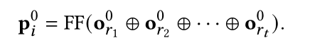

其中$o_{r_t}^0$表示嵌入矩阵中对关系$r_t$的表示。

本文使用下式进行特征聚合：

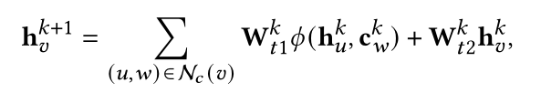

$h_u^k$是第k层节点u的嵌入向量，$c_w^k$是第k层上下文（边）w的嵌入。$\phi$函数定义如下：

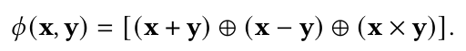

文中说$\phi$用这个式子是因为它强大的表现能力。

#### Subgraph Modeling

本文使用了一种具有边缘感知和关系感知注意机制的GCN来处理子图，它用下式来更新节点：

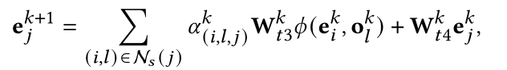

其中$(i,l,j)$是一个triple，$(i,l)$是j的邻居节点和邻居关系元组，$e_j^k$是实体j在第k层的嵌入，$o_l^k$是关系l在第k层的嵌入（在context graph中得到），$\alpha_{(i,l,j)}^k$是注意力权重，它由下式计算：

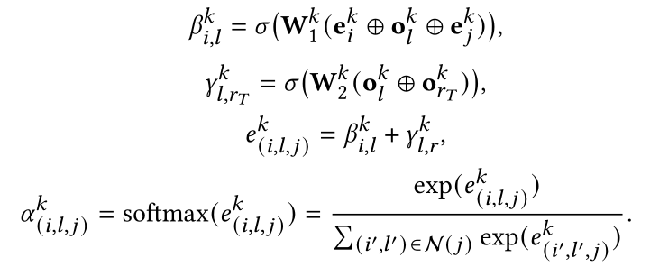

其中$\beta$是edge-aware attention（中心节点邻接边感知），$\gamma$是relation-aware attention（中心节点邻接关系的感知）。

刚才从context graph中拿来了关系嵌入，有来有回，这里也会使用实体嵌入来增强context graph中的实体表示：

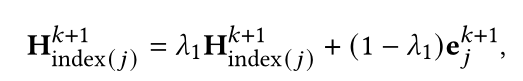

本文还使用bidirectional Gated Recurrent Unit (GRU)来对实体嵌入处理，用于增强模型的表现能力。

#### Inductive Prediction and Training Regime

最后在子图第k层可以得到实体的嵌入**E**，在context graph第k层可以得到节点的嵌入**H**。规则的置信度$\mu$由关系路径与目标关系嵌入点乘计算：

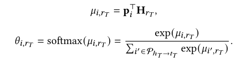

目标关系路径的嵌入就是关系路径嵌入的加权和：

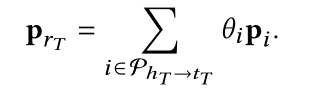

最后一个三元组$(h_T,r_T,t_T)$的分数为：
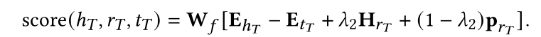

Loss函数还是经典的Loss

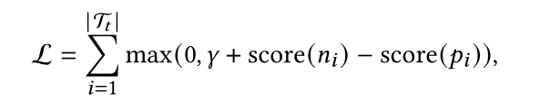

至此ConGLR模型就介绍完了，最后放上一个该模型的总体算法流程图：

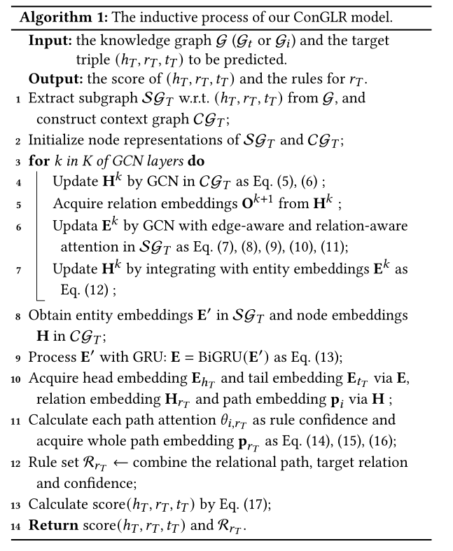