inductive

简单来说inductive可以处理在训练的时候没有见过的实体而transductive则不行

关系推理可以是一个逻辑归纳的问题，也就是如何从已有的知识图谱中归纳出关系并且在预测的时候利用关系。

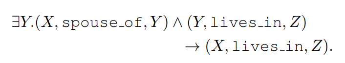

### GraIL

模型设计的是让该模型可以捕获到KG中潜在的规则，而不用对每一个实体学习一个专门的表示。这里的假设是对于两个需要被预测关系的目标节点（目标实体），它们之间的路径包含了被预测关系的信息。整个模型分为三个步骤

1.对于两个目标关系，采样出它们之间的周围局部路径图结构；

2.对局部图中的节点的表示进行初始化，初始化中包含了相关的结构信息；

3.利用图神经网络进行消息传递，利用得到的节点表示和整个局部图表示进行关系预测
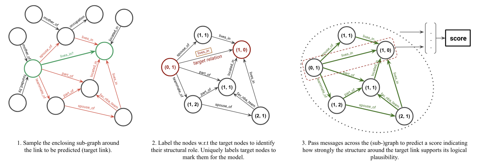

子图挖掘（SubgraphExtraction）。对两个目标节点，取它们周围k-hop的周围子图，然后对两个子图求交集，最终去掉独立的点以及与两个点距离大于k的点。这样的操作可以得到在两个目标节点距离最长k+1的所有路径作为子图。

节点标签（NodeLabeling）。图神经网络的操作一般需要节点具有特征表示作为初始化，但在这里假设没有任何KG的特征表示。这里通过度量每个点和目标节点的距离对节点进行表示，例如对于目标节点为u, v的子图，其中的一点i，用一个元组(d(i, u), d(i, v))表示，其中d(. , .)表示两点最短距离。特别的u, v两点分别以(0, 1)，(1, 0)进行表示。节点的初始化特征表示就用对该特征的one-hot编码进行表示。

利用图神经网络打分（GNNScoring）。这里借鉴了R-GCN的方法来建模对多关系图的消息传递，区别在于增加了一个注意力机制，该注意力机制不仅仅和两个相邻节点以及它们之间的关系有关，也和需要被预测的目标关系有关。最终利用两个目标节点的表示，整个图的表示，以及被被预测关系的表示，对该目标节点之间具有该目标关系进行打分，得分最高的目标关系为被预测关系。

### CoMPILE

CoMPILE通过通信内核加强了边和实体之间的消息交互，并实现了足够的关系信息流。此外，我们证明了CoMPILE可以自然地处理不对称/反对称关系，而不需要通过提取有向闭合子图来爆炸性地增加模型参数的数量。

考虑到两个三元组（hT，rT，tT）和（tT，rT，hT），如果我们使用无向封闭子图，那么这两个三元组的预测可能非常接近，因为封闭子图是相同的。然而，如果关系rT是不对称的，则只有其中一个是正确的。因此，我们需要使用有向包围子图来更有效地处理这些类型的关系。同时时间复杂度甚至会降低，因为有向包围子图是通过修剪无向包围子图形获得的。

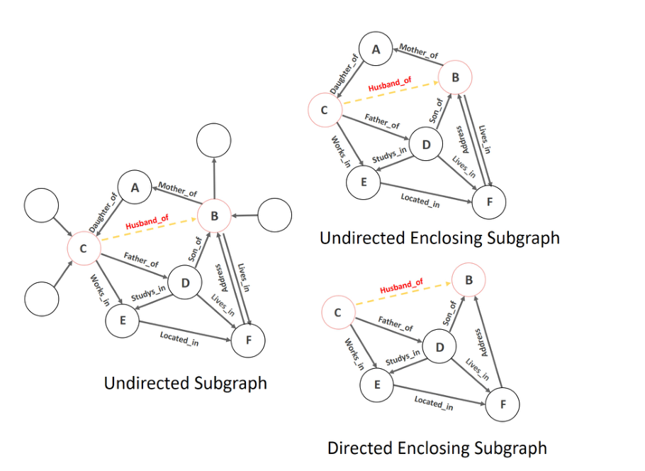

GraIL中消息传递简单地使用了RGCN中的方式，忽略了单独建模边嵌入，并忽略了边和节点之间的双向通信。同时GraIL使用节点到节点的消息传递机制，其中关系信息仅用于计算相邻节点的权重。然而，归纳关系推理应该是无实体的，其中关系起主导作用，而实体在推理期间不能提供确定性信息。因此，Grail中的节点到节点消息传递机制削弱了关系的作用，违反了归纳知识图的本质。为此，我们设计了一种全新的消息传递体系结构，通过迭代通信和增强边和节点嵌入，对归纳封闭子图进行建模。

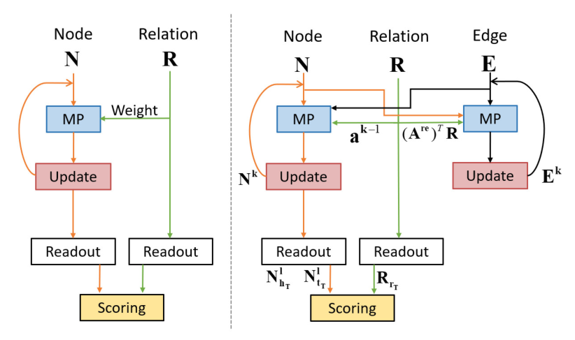

节点embedding更新

对于边缘（hi，ri，ti），其嵌入仅用于更新尾部ti，而不是hi。与有向子图相结合，它确保了信息仅从目标头部流向目标尾部，并且禁止反向流动。

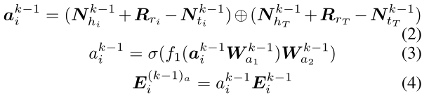

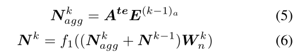

在节点嵌入更新的最后一次迭代中，类似于CMPNN（Song等人2020），我们使用多层感知网络，然后使用门控递归单元来实现更新操作，以提高网络的表达能力。

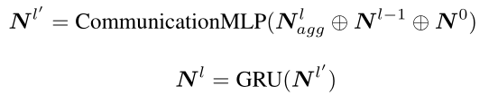

边embedding更新

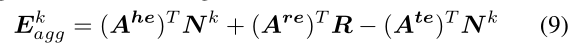

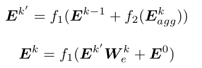

E0用来进行残差学习

### ConGLR

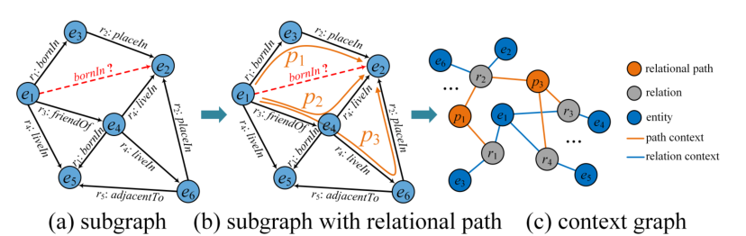

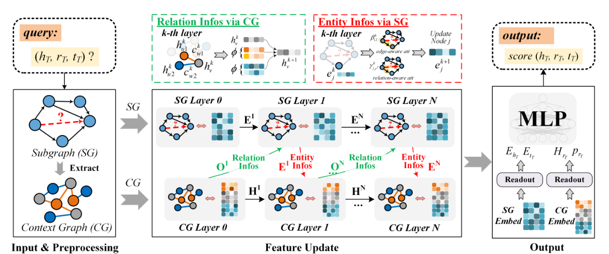

其中$\beta$是edge-aware attention（中心节点邻接边感知），$\gamma$是relation-aware attention（中心节点邻接关系的感知）。

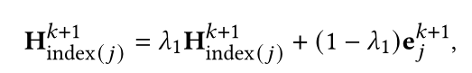

### SNRI

大多数以前的作品学习实体的实体特定嵌入，这些嵌入无法处理看不见的实体。最近的几种方法利用封闭子图来获得归纳能力。然而，所有这些工作都只考虑了子图的封闭部分，而没有完整的邻接关系，这导致了部分邻接关系被忽略，稀疏子图难以处理的问题。为了解决这个问题，我们提出了SNRI，它从两个方面充分利用了完整的相邻关系：节点特征的相邻关系特征和稀疏子图的相邻关系路径。为了进一步以全局方式建模相邻关系，我们创新性地将互信息（MI）最大化应用于知识图。

我们保留每个节点的完整相邻关系N r（u），其中包含闭合子图省略的关系。

在初始化节点嵌入时增加了注意力信息。

对于每个相邻关系路径p，我们首先使用门控递归网络（GRU）对其进行建模

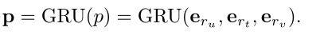

然后，我们集中所有路径表示，以获得子图路径表示pG：

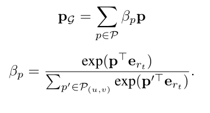

为了避免SNRI中的子图神经网络过分强调局部结构，我们进一步通过最大化局部全局互信息（MI），也就是说，我们寻求使相邻的关系特征和路径能够捕获整个KG的全局信息

采用了鉴别器D（sG，sG），其给子图对分配概率分数：

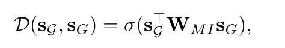

知识图的MI目标是通过对比正负子图对来实现的：

### MorsE

KG内应用，例如链接预测和三元组分类；以及KG外应用，例如问答和推荐系统。

学习可转移的元知识，这些元知识可以用来产生实体嵌入。

原有KGE不能用在归纳设置上，原有归纳方法也不能像KGE方法那样处理其他KG外任务，因此提出MorsE模型，使得可以在归纳设置上用于KG内外任务。

传统的KGE方法就像一个只能识别可见实体的婴儿，而归纳KGE可以通过可转移的结构模式识别不可见的实体。

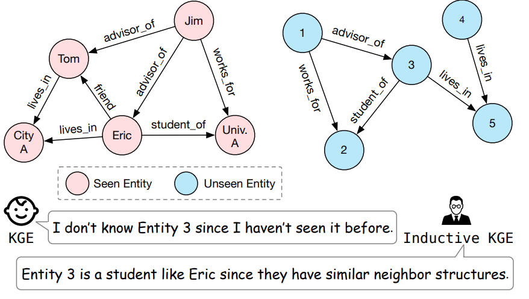

虽然这些方法被证明适合于归纳关系预测任务，但由于它们不产生实体的嵌入，因此不能解决其他KG外的任务。

为了解决这个问题，我们求助于人类认知的过程。如图1所示，传统的KGE方法就像一个婴儿，只能认知他们所看到的实体。相比之下，成年人可以通过比较邻居的结构模式和看到的实体来认知一个新的实体。这种帮助人类理解新实体的语义的结构模式是通用的、独立于实体的，并且是可转移的。在本文中，我们将关于这种可转移结构模式的知识统称为元知识。正是建模和学习这种元知识的能力，使得成人和模型能够成功地在归纳环境中处理KG。

受此启发，本文提出了一种新的归纳KGE元知识转移模型(MORSE)，该模型通过建模和学习与实体无关的元知识，为归纳环境中的新实体生成高质量的嵌入。

1. 将元知识实例化为两个模块，一个**实体初始化器**和一个**图神经网络(GNN)** 调制器

2. 实体初始化器通过两个实体无关的嵌入(关系域嵌入和关系范围嵌入)来初始化每个实体嵌入。

3. GNN调制器基于实体的邻居结构信息来增强实体嵌入，使其从类型级别提升到实例级别。
   总体而言，这两个模块的参数独立于任何特定实体，并且可以在模型训练后适应于具有不可见实体的KG。

